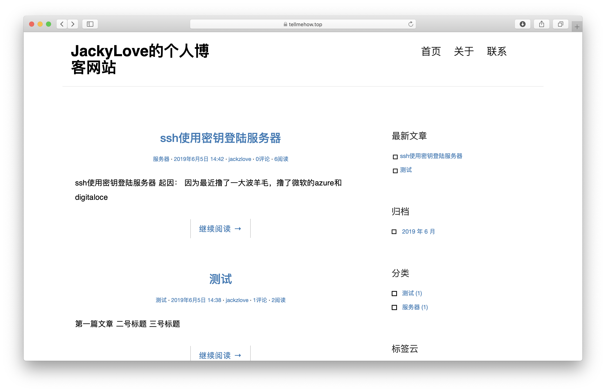
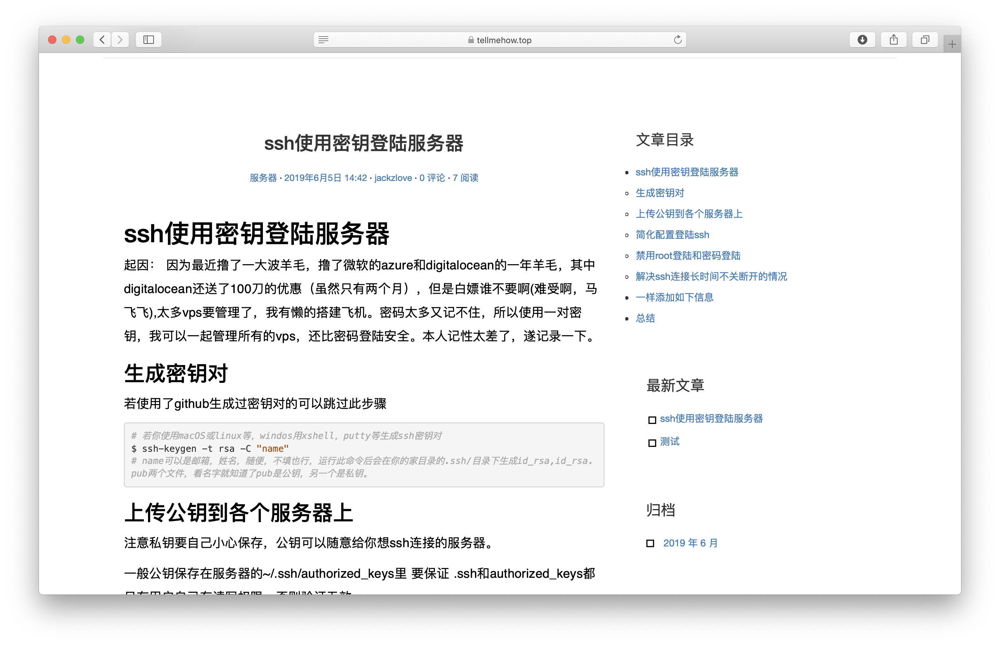

# Django个人博客
## 通过django这个博客框架来编写个人博客网站来练习和熟悉django这个框架。

### 版本
python3.7
django 2.2
后台是mysql

### 部署
部署时遇到时区问题：  
[mysql归档时间问题](https://chowyi.com/Django%E4%BD%BF%E7%94%A8MySQL%E5%90%8E%E7%AB%AF%E6%97%A5%E6%9C%9F%E4%B8%8D%E8%83%BD%E6%8C%89%E6%9C%88%E8%BF%87%E6%BB%A4%E7%9A%84%E9%97%AE%E9%A2%98%E5%8F%8A%E8%A7%A3%E5%86%B3%E6%96%B9%E6%A1%88/)

### 演示网站
(博客展示站点)[https://www.tellmehow.top/]

### 结果截图

